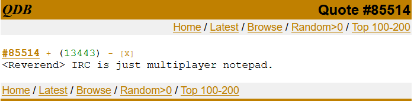

Start of README file
# 👾 ft_irc : Intro to Web Protocols 👾 #

A minimal IRC server written in C++ as part of the 42 cursus

*carefully coded by sabellil & mairivie from 42Paris*


## Assignement ##

The server must be a non-blocking, multi-client TCP server capable of handling all connections simultaneously without hanging. 
All I/O operations must be managed through a single poll().

The server must be compatible with a chosen reference IRC client (IRSSI in our case), which should connect without errors and behave similarly to a standard IRC server.

Core features include client authentication (PASS, NICK, USER), channel management (JOIN, PART), and message exchange (PRIVMSG).

The server must manage user roles, distinguishing operators from regular users. Operators have access to additional commands: KICK, INVITE, TOPIC, and MODE.

The MODE command must support key channel configurations: invite-only (i), topic restrictions (t), password protection (k), operator privileges (o), and user limits (l).

The implementation must be stable, handle errors and disconnections properly, and maintain clean, readable, and maintainable code.

## Context ##


What's IRC Protocol ?


### User note ##

*/me install the project*

``` 
git clone https://github.com/sabellil/ft_irc.git
cd ft_irc
make
```

*/me start the server*
```
./ircserv <port> <password>

port: The port number on which your IRC server will be listening for incoming IRC connections. 
    Usual IRC port is 6667 but we choose to be more flexible.
password: The connection password. It will be needed by any IRC client that tries to connect to your server. 
    No security requirement in the subject. We choose to only ask for at least 4 char long.
```

*/me connect a client*

## Technichal note ##


What's a socket ?
init, bind, listen
With the great help of https://beej.us/guide/bgnet/html/split-wide/index.html

## Ressources ##


Sources:

- http://manpagesfr.free.fr/man/man2/accept.2.html
- https://man7.org/linux/man-pages/man2/poll.2.html